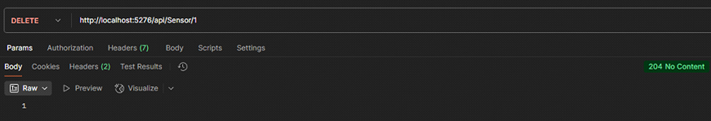

# 🌍 AlertaSolo - Sistema de Monitoramento de Locais de Risco

API RESTful desenvolvida em .NET para monitoramento de áreas com risco de deslizamento de terra. A aplicação permite o gerenciamento de usuários, locais de risco e sensores (ESP32), integrando dados ambientais para prevenção de desastres.

---

## ⚙️ Tecnologias Utilizadas

- ✅ ASP.NET Core 7
- ✅ Entity Framework Core
- ✅ Oracle Database (FIAP)
- ✅ Swagger (Swashbuckle)
- ✅ RESTful API Architecture
- ✅ Visual Studio / CLI

---

## 👥 Integrantes

- Vinicius Leandro de Araujo Bernardes – RM554728 – Turma 2TDSPY  
- Edvan Davi Murilo Santos do Nascimento – RM554733 – Turma 2TDSPZ  
- Rafael Romanini de Oliveira – RM554637 – Turma 2TDSPZ  

---

## 🎯 Objetivo

- Comunicar-se com ESP32 via rede/local.
- Receber valores ambientais como umidade, inclinação e tremor.
- Gerar alertas automáticos para possíveis riscos de deslizamento.
- Integrar um backend pronto para aplicações web/mobile e sistemas de notificação.

---

## 🧱 Desenvolvimento da Solução
O projeto AlertaSolo foi desenvolvido utilizando a arquitetura em camadas com boas práticas de programação e organização. A solução é composta por uma API RESTful desenvolvida em .NET 7, responsável por gerenciar as entidades do sistema: Usuários, Locais de Risco e Sensores conectados a dispositivos ESP32.

A comunicação entre os sensores e a API ocorre via protocolo HTTP, simulando o envio de dados ambientais como umidade, tremor e inclinação. Esses dados são processados pela API e armazenados em um banco de dados Oracle, utilizando Entity Framework Core para o mapeamento e manipulação das tabelas.

A aplicação também conta com uma interface web utilizando Razor Pages com TagHelpers, permitindo a visualização de dados e o cadastro de novos sensores diretamente pelo navegador. O sistema foi estruturado para facilitar futuras integrações com notificações automáticas e visualizações em dashboards.

Todo o código foi separado por responsabilidades: controladores para rotas, services para regras de negócio, models para representação das entidades e DTOs para segurança e clareza nas requisições. Isso garante um projeto escalável, testável e de fácil manutenção.

---

## 📐 Diagrama


---

## 🗂️ Estrutura de Pastas

```
AlertaSolo/
├── Controllers/           # Controladores REST
├── DTO/                   # Objetos de transferência de dados
├── Model/                 # Entidades do domínio
├── Services/              # Implementações de regras de negócio
│   └── Abstractions/      # Interfaces dos serviços
├── Data/
│   ├── Mappings/          # Mapeamentos do EF Core (Fluent API)
│   └── Exceptions/        # Exceptions personalizadas
├── Pages/                 # Uso de Razor e TagHelpers
│   ├── Sensores/          # Pages Sensores 
│      ├── Index.cshtml/   # Página Razor para exibir dados dos sensores (HTML + TagHelpers)
│      ├── Index.cshtml.cs # Código C# vinculado à página Razor (handler de requisições e lógica)
├── Migrations/            # Migrations do EF Core
├── appsettings.json       # Configuração de conexão
└── Program.cs             # Inicialização do projeto
```

---

## 🚀 Como Rodar o Projeto

1. Instale o .NET SDK 7
2. Configure o `appsettings.json` com seus dados Oracle FIAP
3. Rode os comandos:

```bash
dotnet ef database update
dotnet run
```

4. Acesse:
```
https://localhost:7177/swagger
https://localhost:7177/Sensores
```

---

## 📦 Entidades

### Usuario
- id
- nome
- cpf
- idade
- cidade
- uf
- email
- senha
- dataCadastro

### LocalRisco
- id
- nomeLocal
- latitude
- longitude
- cidade
- uf
- grauRisco
- ativo

### Sensor
- id
- codigoEsp32
- status
- tipoSensor
- dataInstalacao
- qntdAlertas
- localRiscoId

---

## 🔁 Exemplos de Requisições

### 🧍‍♂️ Usuário

#### ➕ Criar
`POST /api/usuario`
```json
{
  "nome": "Maria",
  "cpf": "12345678901",
  "idade": 30,
  "cidade": "São Paulo",
  "uf": "SP",
  "email": "maria@email.com",
  "senha": "123"
}
```


#### 📄 Listar todos
`GET /api/usuario`


#### 🔍 Buscar por ID
`GET /api/usuario/{id}`


#### ✏️ Atualizar
`PUT /api/usuario/{id}`
```json
{
  "nome": "Maria Oliveira",
  "idade": 31,
  "cidade": "Santos",
  "uf": "SP",
  "email": "maria.oliveira@email.com"
}
```


#### 🗑️ Deletar
`DELETE /api/usuario/{id}`


---

### 🏞️ Local de Risco

#### ➕ Criar
`POST /api/localrisco`
```json
{
  "nomeLocal": "Morro do Céu",
  "latitude": "-23.5",
  "longitude": "-46.6",
  "cidade": "Santos",
  "uf": "SP",
  "grauRisco": 4,
  "ativo": true,
  "usuarioId": 1
}
```


#### 📄 Listar todos
`GET /api/localrisco`


#### 🔍 Buscar por ID
`GET /api/localrisco/{id}`


#### ✏️ Atualizar
`PUT /api/localrisco/{id}`
```json
{
  "nomeLocal": "Morro do Céu",
  "latitude": "-23.51",
  "longitude": "-46.62",
  "cidade": "Santos",
  "uf": "SP",
  "grauRisco": 5,
  "ativo": true
}
```


#### 🗑️ Deletar
`DELETE /api/localrisco/{id}`


---

### 🧭 Sensor

#### ➕ Criar
`POST /api/sensor`
```json
{
  "codigoEsp32": "ESP32-ABC",
  "status": "Ativo",
  "tipoSensor": "Multissensor",
  "qntdAlertas": 0,
  "localRiscoId": 1
}
```


#### 📄 Listar todos
`GET /api/sensor`


#### 🔍 Buscar por ID
`GET /api/sensor/{id}`


#### ✏️ Atualizar
`PUT /api/sensor/{id}`
```json
{
  "status": "Inativo",
  "tipoSensor": "Umidade",
  "qntdAlertas": 3
}
```


#### 🗑️ Deletar
`DELETE /api/sensor/{id}`



---

📬 Em caso de dúvidas ou sugestões, entre em contato com qualquer membro do grupo.
